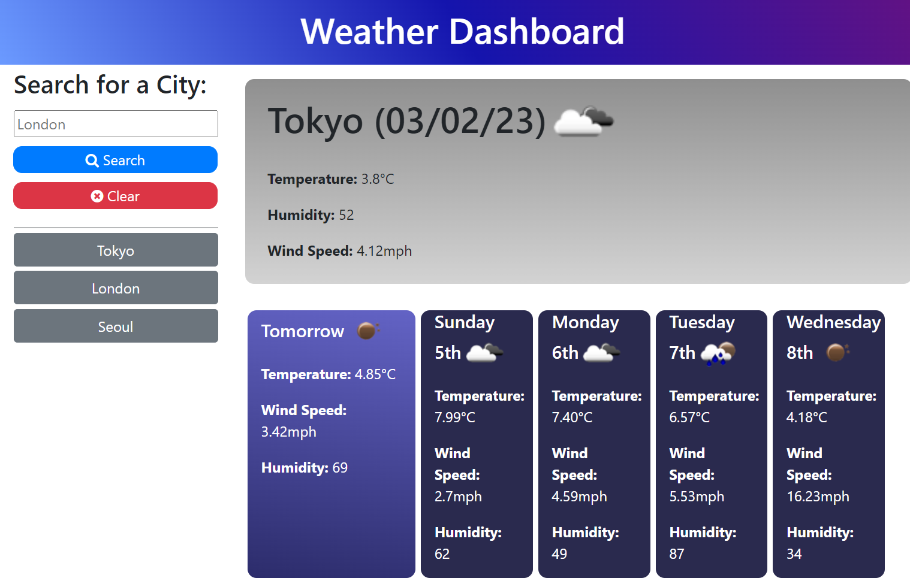

# Weather Dashboard

## Link to site

https://daisyeverard.github.io/Weather-Dashboard/

## Preview

  

## Overview

A dashboard where you can search for a city and see the current weather conditions, and forecast for the next 5 days

## Features

- Seach bar for desired city
- clear button to remove history buttons and remove local storage item
- History buttons showing 10 most recently searched cities
- If city searched already in buttons, that button moves to most recent
- When button clicked, that button moves to most recent
- Box for today's weather with: 
    - Today's date
    - Icon to represent the weather
    - Temperature
    - Humidity
    - Wind Speed

- Boxes for 5 days in the future, each at the same time of day with:
    - Day
    - Temperature
    - Wind Speed
    - Humidity

- Tomorrow box has unique title 'tomorrow', different colour, and larger size on most screens. 

## License

MIT License
